# Creating Joint Account with Solidity

## Table of content
- [Overview of the project](https://github.com/sakesam/Solidity_Joint_Account#overview-of-the-project) 
- [Project goals](https://github.com/sakesam/Solidity_Joint_Account#project-goals)
- [Project steps](https://github.com/sakesam/Solidity_Joint_Account#project-steps)
- [Software version control](https://github.com/sakesam/Solidity_Joint_Account#software-version-control)

## Overview of the project 

To automate the creation of joint savings accounts, I am creating Solidity smart contract that accepts two user addresses. These addresses will be able to control a joint savings account. Smart contract uses ether management functions to implement a financial institution’s requirements for providing the features of the joint savings account. These features consist of the ability to deposit and withdraw funds from the account.

## Project goals

## Project steps 

    ###Step 1: Create a Joint Savings Account Contract in Solidity
   

* From the provided starter code, open the Solidity file named joint_savings.sol in the Remix IDE.

* Define a new contract named JointSavings.

* Define the following variables in the new contract:

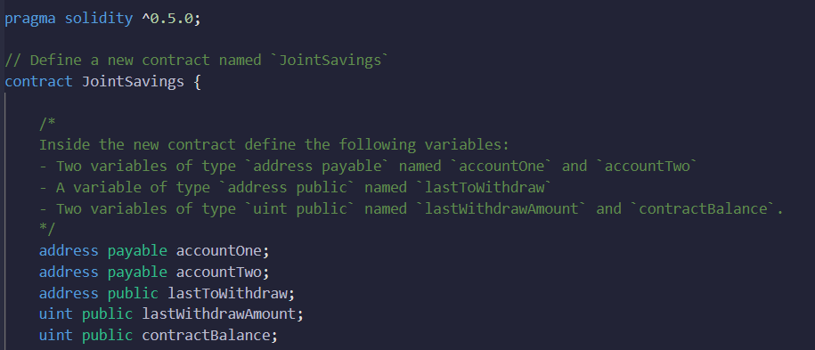

* Define a function named withdraw that accepts two arguments: amount of type uint and recipient of type payable address. In this function, code the following:

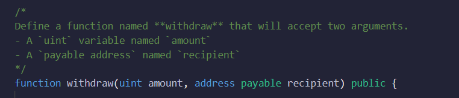

* Define a require statements

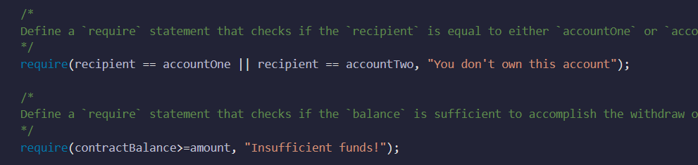

* Add an if statement to check if lastToWithdraw is not equal (!=) to recipient. If it’s not equal, set it to the current value of recipient.

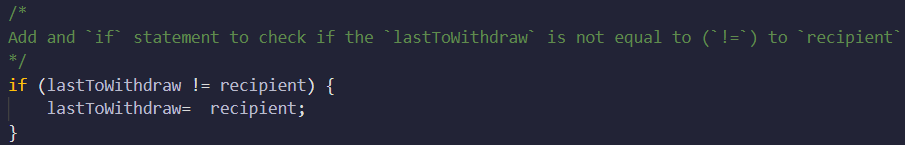

* Call the transfer function of the recipient, and pass it the amount to transfer as an argument. Set lastWithdrawAmount equal to amount. Set the contractBalance variable 

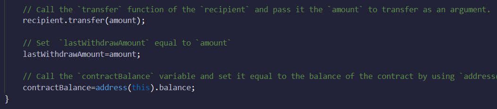

* Define a public payable function named deposit. In this function, code the following: Set the contractBalance variable, Define a public function, set the values of accountOne and accountTwo 

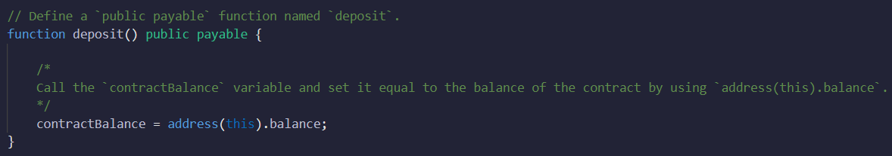

* Add a fallback function so that your contract can store ether that’s sent from outside the deposit function.

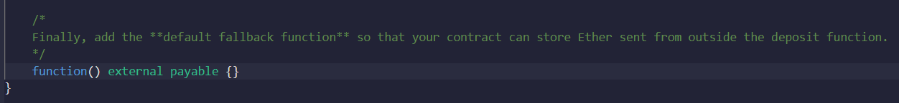

    Step 2: Compile and Deploy Your Contract in the Remix VM london
    
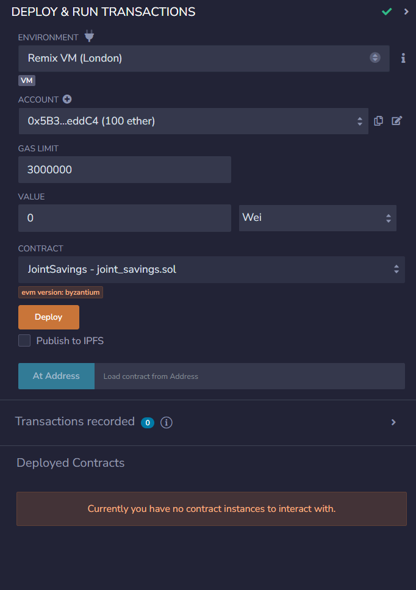

    Step 3: Interact with Your Deployed Smart Contract

To interact with your deployed smart contract, complete the following steps:

* Use the setAccounts function to define the authorized Ethereum address that will be able to withdraw funds from your contract.

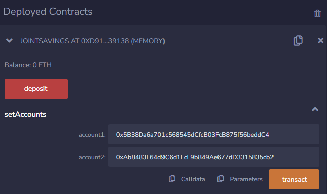

* Test the deposit functionality of your smart contract by sending the following amounts of ether. After each transaction, use the contractBalance function to verify that the funds were added to your contract:

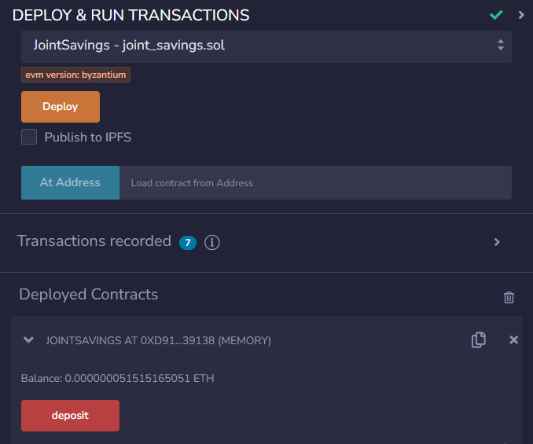

##### Transaction 1: Send 1 ether as wei.

##### Transaction 2: Send 10 ether as wei.

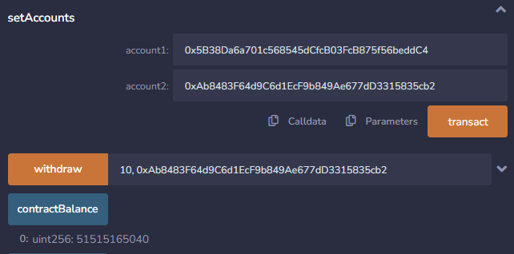

##### Transaction 3: Send 5 ether.

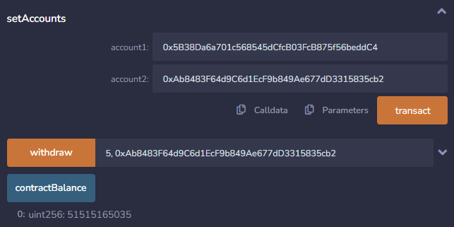

##### Once you’ve successfully deposited funds into your contract, test the contract’s withdrawal functionality by withdrawing 5 ether into accountOne and 10 ether into accountTwo. After each transaction, use the contractBalance function to verify that the funds were withdrawn from your contract. 

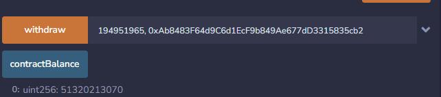

##### Use the lastToWithdraw and lastWithdrawAmount functions to verify that the address and amount were correct.

## Software version control

[Remix IDE](https://remix.ethereum.org) used to interact with Ethereum blockchain.

Remix - Ethereum IDE is an open source web and desktop application. It fosters a fast development cycle and has a rich set of plugins with intuitive GUIs. Remix is used for the entire journey of contract development as well as being a playground for learning and teaching Ethereum.

